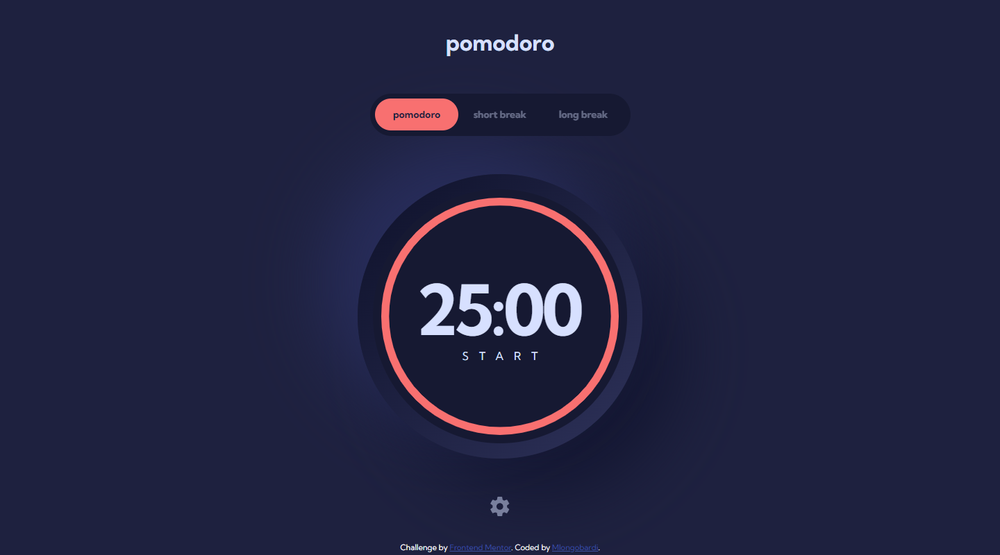

# Frontend Mentor - Pomodoro app solution

This is a solution to the [Pomodoro app challenge on Frontend Mentor](https://www.frontendmentor.io/challenges/pomodoro-app-KBFnycJ6G). Frontend Mentor challenges help you improve your coding skills by building realistic projects. 

## Table of contents

- [Overview](#overview)
  - [The challenge](#the-challenge)
  - [Screenshot](#screenshot)
  - [Links](#links)
- [My process](#my-process)
  - [Built with](#built-with)
  - [What I learned](#what-i-learned)
  - [Continued development](#continued-development)
  - [Useful resources](#useful-resources)
- [Author](#author)

## Overview

### The challenge

Users should be able to:

- Set a pomodoro timer and short & long break timers
- Customize how long each timer runs for
- See a circular progress bar that updates every minute and represents how far through their timer they are
- Customize the appearance of the app with the ability to set preferences for colors and fonts

### Screenshot



### Links

- Solution URL: [https://github.com/MLongobardi/FEM-pomodoro-app](https://github.com/MLongobardi/FEM-pomodoro-app)
- Live Site URL: [https://fem-pomodoro-app-mlongobardi.vercel.app/](https://fem-pomodoro-app-mlongobardi.vercel.app/)

## My process

### Built with

- Semantic HTML5 markup
- CSS custom properties
- CSS math functions like clamp()
- Flexbox
- CSS Grid
- [Svelte](https://svelte.dev/) - JS framework
- [Sveltekit](https://kit.svelte.dev/) - Svelte framework

### What I learned

In my last project I used js to detect screen size changes and apply different classes to the body in an attempt to avoid having to manage several media queries in multiple, separate Svelte components. In this project, I used a different approach:

```css
* {
	--min-screen: 375; /*Change me*/
	--max-screen: 768; /*Change me*/
	
	--size-at-min: var(--min-size, 35);
	--size-at-max: var(--max-size, 50);
	
	--slope: calc((var(--size-at-max) - var(--size-at-min)) / (var(--max-screen) - var(--min-screen)));
	--yIntersection: calc(var(--size-at-min) - var(--min-screen) * var(--slope));
	
	--clampedSize: clamp(
		var(--size-at-min) * 1px,
		var(--yIntersection) * 1px + var(--slope) * 100vw,
		var(--size-at-max) * 1px
	);
}

.myDiv {
  --min-screen: 400;
  --max-screen: 800;

  --min-size: 10;
  --max-size: 100;
  width: var(--clampedSize);
}
```
By setting the --min-size and --max-size css custom properties in the object you want to scale, --clampedSize will return --min-size if the screen is smaller than --min-screen, --max-size if it is bigger than --max-screen, and a linearly interpolated value between the two if the screen size is between --min-screen and --max-screen. For example with the above rules myDiv's width will be 55px at screen width 600px.
\
\
\
This is another cool CSS trick (from SettingsBody.svelte):
```css
.time-section {
	--cols: 3;
	--min-item-width: 140px;
	--gap: max(5px, (100% - var(--cols) * var(--min-item-width)) / (var(--cols) - 1));
	--magic-number: clamp(
		100% / var(--cols) - var(--gap),
		(var(--min-item-width) * var(--cols) - var(--gap) * 2 - 100%) * 999,
		100%
	); /*the middle argument is either a negative or a positive value that is multiplied by 999, forcing clamp's result to be either the first or the last argument*/

	display: grid;
	column-gap: var(--gap);
	row-gap: 8px;
	grid-template-columns: repeat(auto-fit, minmax(var(--magic-number), 1fr));
}
```
This creates a grid that has a number of columns equal to --cols where each column's width is --min-item-width. However, if there isn't enough space to fit all the columns, the grid collapses into a single column allowing for a mobile version.
The --gap formula sets a column gap that fills all the remaining space, simulating flexbox's justify-content: space-between (but with a minimum of a 5px gap).

### Continued development

Applying the CSS rule I described before to every single element with the * selector is overkill and making it into a class I have to manually apply to the objects I want to scale is mildly annoying, so I could use Sass or another CSS preprocessor and make it into a mixin. 

### Useful resources

- [Linearly Scale font-size with CSS clamp() Based on the Viewport](https://css-tricks.com/linearly-scale-font-size-with-css-clamp-based-on-the-viewport/) - I got the idea (and the math) for --clampedSize's calculations here.
- [Flexible layouts without media queries](https://blog.logrocket.com/flexible-layouts-without-media-queries/) - And the idea for the collapsing grid came from here. 

## Author

- GitHub - [@MLongobardi](https://github.com/MLongobardi)
- Frontend Mentor - [@MLongobardi](https://www.frontendmentor.io/profile/MLongobardi)
